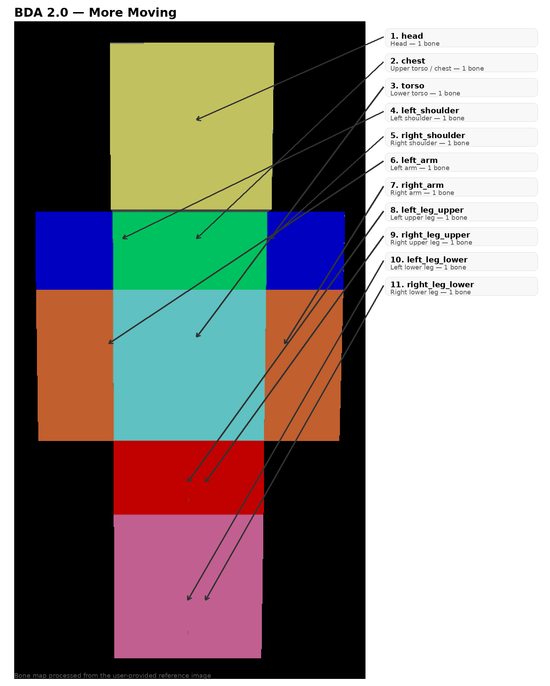

# BDA 2.0 — More Moving

Подробная документация по формату `.bda` версии **2.0**.

---

## 1. Общая идея

BDA 2.0 — это развитие базового формата BDA, ориентированное на **более детальную анимацию персонажа**.

Формат описывает:

- одного или нескольких персонажей;
- положение персонажа в пространстве;
- вращение персонажа в пространстве;
- анимацию 11 костей;
- ключевые точки по времени;
- интерполяцию;
- более естественные движения рук, корпуса и ног.

---

## 2. Корневая структура

```json
{
  "format": "bda",
  "version": "2.0",
  "profile": "more_moving",
  "animation": {}
}
```

### Обязательные поля

| Поле | Тип | Описание |
|---|---|---|
| `format` | string | всегда `bda` |
| `version` | string | всегда `2.0` |
| `profile` | string | всегда `more_moving` |
| `animation` | object | блок анимации |

---

## 3. Animation

```json
"animation": {
  "name": "hello",
  "duration": 6.0,
  "fps": 20,
  "loop": false,
  "characters": []
}
```

### Поля

- `name` — имя анимации;
- `duration` — длительность в секундах;
- `fps` — рекомендуемая частота для редактора;
- `loop` — зациклена ли анимация;
- `characters` — массив персонажей.

---

## 4. Структура персонажа

```json
{
  "id": "alice",
  "space": {},
  "bones": {}
}
```

### `id`

Уникальный идентификатор персонажа внутри файла.

### `space`

Необязательная анимация положения и вращения персонажа в пространстве.

### `bones`

Набор из 11 костей формата BDA 2.0.

---

## 5. Схема костей по референсу



### Соответствие рисунку

| Цвет на рисунке | Кость |
|---|---|
| Бежевый | `head` |
| Зелёный | `chest` |
| Голубой | `torso` |
| Синий слева | `left_shoulder` |
| Синий справа | `right_shoulder` |
| Оранжевый слева | `left_arm` |
| Оранжевый справа | `right_arm` |
| Красный слева/сверху | `left_leg_upper` и `right_leg_upper` |
| Розовый слева/снизу | `left_leg_lower` и `right_leg_lower` |

---

## 6. Полный список костей

```text
head
chest
torso
left_shoulder
left_arm
right_shoulder
right_arm
left_leg_upper
left_leg_lower
right_leg_upper
right_leg_lower
```

---

## 7. Иерархия

Рекомендуемая фиксированная иерархия:

```text
torso
├── chest
│   ├── head
│   ├── left_shoulder
│   │   └── left_arm
│   └── right_shoulder
│       └── right_arm
├── left_leg_upper
│   └── left_leg_lower
└── right_leg_upper
    └── right_leg_lower
```

Практический смысл:

- `torso` — база корпуса;
- `chest` — верх корпуса;
- `head` — отдельный контроль головы;
- `*_shoulder` — поднимает и направляет руку;
- `*_arm` — основное движение руки;
- `*_leg_upper` — бедро;
- `*_leg_lower` — нижняя часть ноги.

---

## 8. Space

Положение персонажа в мире:

```json
"space": {
  "position": {
    "0.0": [-2.5, 0, 0],
    "2.0": {
      "value": [-0.8, 0, 0],
      "easing": "ease_in_out"
    }
  },
  "rotation": {
    "0.0": [0, -90, 0]
  }
}
```

### Форматы

- `position` = `[x, y, z]`
- `rotation` = `[pitch, yaw, roll]`

---

## 9. Bone tracks

У каждой кости можно описывать:

- `rotation`
- `position`

### Пример

```json
"left_shoulder": {
  "rotation": {
    "0.0": [0, 0, 0],
    "1.0": [-18, 0, -10],
    "2.0": [0, 0, 0]
  }
}
```

---

## 10. Keyframes

### Короткая запись

```json
"1.2": [0, 45, 0]
```

### Полная запись

```json
"1.2": {
  "value": [0, 45, 0],
  "easing": "ease_in_out"
}
```

### Поддерживаемые easing

```text
linear
step
smoothstep
ease_in
ease_out
ease_in_out
bezier
```

### Ключ с bezier

```json
"1.2": {
  "value": [0, 45, 0],
  "easing": "bezier",
  "bezier": [0.25, 0.1, 0.25, 1.0]
}
```

---

## 11. Улучшения формата в 2.0

По сравнению с упрощённым базовым видом, BDA 2.0 получает:

1. **разделённый корпус** — `chest` и `torso`;
2. **разделённые руки** — плечо и рука;
3. **разделённые ноги** — верх и низ;
4. **фиксированную иерархию**, чтобы позы были предсказуемыми;
5. поддержку `bezier` easing;
6. более подходящую структуру для рукопожатий, ходьбы, поворотов корпуса и наклонов.

---

## 12. Пример персонажа

```json
{
  "id": "player",
  "space": {
    "position": {
      "0.0": [0, 0, 0]
    },
    "rotation": {
      "0.0": [0, 180, 0]
    }
  },
  "bones": {
    "head": {},
    "chest": {},
    "torso": {},
    "left_shoulder": {},
    "left_arm": {},
    "right_shoulder": {},
    "right_arm": {},
    "left_leg_upper": {},
    "left_leg_lower": {},
    "right_leg_upper": {},
    "right_leg_lower": {}
  }
}
```

---

## 13. Пример более живого движения руки

```json
"right_shoulder": {
  "rotation": {
    "0.0": [0, 0, 0],
    "1.2": {
      "value": [-20, -6, -12],
      "easing": "ease_out"
    },
    "2.0": [0, 0, 0]
  }
},
"right_arm": {
  "rotation": {
    "0.0": [0, 0, 0],
    "1.2": {
      "value": [-65, -14, -8],
      "easing": "ease_in_out"
    },
    "2.0": [0, 0, 0]
  }
}
```

Так плечо и сама рука работают независимо.

---

## 14. Пример более живого движения ноги

```json
"left_leg_upper": {
  "rotation": {
    "0.0": [0, 0, 0],
    "0.6": [30, 0, 0],
    "1.2": [-28, 0, 0]
  }
},
"left_leg_lower": {
  "rotation": {
    "0.0": [0, 0, 0],
    "0.6": [8, 0, 0],
    "1.2": [18, 0, 0]
  }
}
```

Это делает походку менее жёсткой.

---

## 15. Hello.bda

В `examples/Hello.bda` хранится демонстрационная сцена с двумя персонажами.

### Что делает пример

- персонажи начинают на расстоянии;
- идут навстречу;
- работают верхом и низом ног;
- вращают `torso` и `chest`;
- отдельно двигают `right_shoulder` и `right_arm`;
- пожимают друг другу руки;
- возвращаются в нейтральную стойку.

---

## 16. Валидация

Runtime BDA 2.0 должен проверить:

- `format == "bda"`
- `version == "2.0"`
- `profile == "more_moving"`
- `duration > 0`
- все `id` персонажей уникальны;
- у каждого персонажа присутствуют все 11 костей;
- каждая keyframe-точка содержит корректный `vec3`;
- время keyframes не выходит за пределы `duration`.

---

## 17. Структура репозитория

```text
BDA-2.0-More-Moving/
├── README.md
├── animation.md
├── docs/
│   └── images/
│       └── bda_2_bone_map.png
├── examples/
│   └── Hello.bda
└── schema/
    └── bda.schema.json
```

---

## 18. Главный принцип

BDA 2.0 остаётся читаемым JSON-форматом, но даёт больше свободы движения за счёт детально разделённых частей тела.

Небольшая анимация всё ещё может быть написана вручную, а сложные анимации получают более качественный контроль рук, корпуса и ног.
